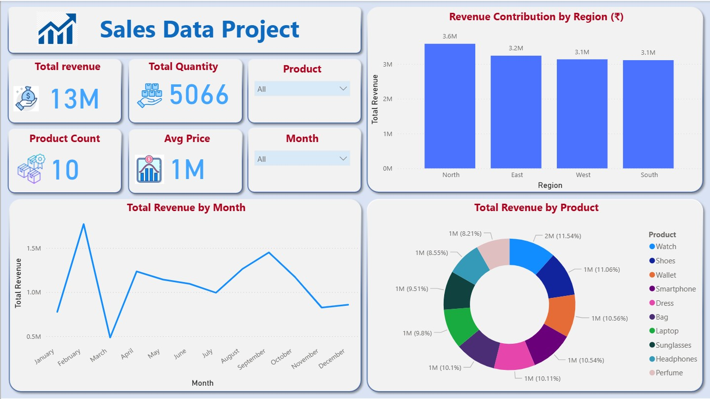

# 📊 Sales Analytics Power BI Dashboard

This repository contains an interactive **Sales Analytics Dashboard** created using **Power BI**.  
It provides clear and actionable insights on **revenue, region performance, product contribution, and monthly sales trends**.

---

## 🚀 Project Summary
This dashboard helps businesses understand:

- Which regions generate the highest revenue  
- Which products perform best  
- Monthly sales fluctuations  
- Overall performance across quantity, revenue, and product categories  

The visual design is clean, modern, and suitable for professional portfolios or interviews.

---

## 📈 Key Metrics
- **Total Revenue:** ₹13M  
- **Total Quantity Sold:** 5066  
- **Total Products:** 10  
- **Average Price:** ₹1M  

---

## 🧭 Dashboard Features
### ✔ KPI Cards  
- Total Revenue  
- Total Quantity  
- Product Count  
- Average Price  

### ✔ Interactive Visuals  
- **Revenue by Region** (Bar Chart)  
- **Total Revenue by Month** (Line Chart)  
- **Revenue by Product** (Donut Chart)  

### ✔ Filters  
- Product filter  
- Month filter  

### ✔ Clean UI  
Designed using modern card-style layout for better readability.

---

## 🖼️ Dashboard Preview  

👉 

---

## 📁 Project Structure
| File | Description |
|------|-------------|
| `Sales_Analytics_Dashboard.pbix` | Main Power BI dashboard |
| `Dashboard_img.jpeg` | Dashboard images |
| `sales_data_project.csv` | Dataset used for building the dashboard |
| `README.md` | Project documentation |

---

## 🗂️ Dataset Information
The dataset contains:

- Revenue  
- Quantity  
- Product Name  
- Product Category  
- Month  
- Region  
- Price  

These fields are used for deriving KPIs, visual insights, and trend analysis.

---

## 🛠 Tools & Technologies
- **Power BI Desktop**
- **DAX Measures**
- **Excel / CSV**

---

## 📥 How To Use This Project
1. Clone or download the repository  
2. Open the `.pbix` file using **Power BI Desktop**  
3. Load/replace the dataset if required  
4. Refresh the report  
5. Explore the interactive visuals  

---

## 👩‍💻 Author  
**Trushali**  
Aspiring Data Analyst | Power BI Learner  

🔗 **LinkedIn:** *(https://www.linkedin.com/in/trushali-babariya-2b0654369/)*  
⭐ If you found this dashboard useful, please consider giving the repository a **star**!

